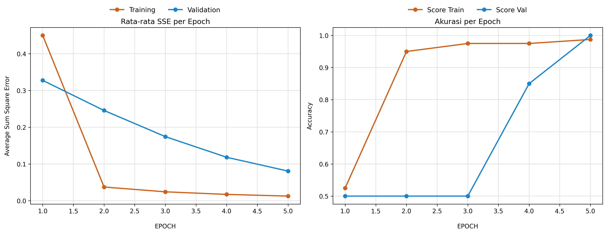

# Single Layer Perceptron (SLP) Implementation

Repositori ini berisi implementasi **Single Layer Perceptron (SLP)**. Model ini dibangun secara matematis dari awal tanpa menggunakan *library* *Machine Learning* siap pakai seperti Scikit-Learn. Model SLP ini dilatih dengan metode *Gradient Descent* untuk menyelesaikan tugas klasifikasi biner.

---
## Fitur Utama
* **Matematis Mandiri:** Menjalankan propagasi maju (*forward propagation*), perhitungan gradien, dan pembaruan bobot (*weight update*) murni menggunakan operasi aljabar linear.
* **Pelacakan Evaluasi Terpadu:** Mencatat metrik *Sum Squared Error* (SSE) dan Akurasi secara simultan selama iterasi berjalan (*on-the-fly*) untuk efisiensi memori.
* **Pengujian Validasi:** Melakukan komparasi performa model pada data latih (*training*) dan data uji (*validation*) pada setiap akhir *epoch*.
* **Visualisasi *Learning Curve*:** Merender grafik pergerakan Akurasi dan rata-rata Error menggunakan palet warna yang modern dan kontras untuk memantau titik konvergensi model.

## Teknologi & Library
* **Python 3**
* **NumPy:** Komputasi matriks (*dot product*) dan penerapan fungsi aktivasi *Sigmoid*.
* **Pandas:** Manajemen dataset, penyaringan (*filtering*), dan visualisasi *history* pelatihan dalam bentuk *DataFrame*.
* **Matplotlib:** Pembuatan plot grafik hasil evaluasi per *epoch*.

## Informasi Dataset
Menggunakan varian dataset botani klasik (Iris Dataset) yang telah dibagi menjadi dua tahap pengujian:
* `slp-train.csv`: Berisi 80 baris data latih.
* `slp-val.csv`: Berisi 20 baris data validasi terpisah untuk menguji generalisasi model.

**Struktur Kolom:**
* **Input (Fitur):** Terdiri dari 4 atribut pengukuran numerik (`X1`, `X2`, `X3`, `X4`).
* **Output (Target):** Pemetaan biner kelas bunga, yaitu `0` untuk *Iris-setosa* dan `1` untuk *Iris-versicolor*.

## Hasil Pelatihan & Evaluasi
Model SLP ini berhasil beradaptasi dengan sangat baik dan mencapai konvergensi hanya dalam **5 Epoch** dengan parameter *Learning Rate* = 0.1. Berikut adalah ringkasan performa model pada *epoch* terakhir:

| Metrik Evaluasi | Data Training | Data Validation |
| :--- | :---: | :---: |
| **Akurasi** | 98.75% | 100% |
| **Rata-rata SSE** | 0.0127 | 0.0808 |

Berdasarkan hasil visualisasi *Learning Curve*, model menunjukkan kemampuan generalisasi yang sangat baik tanpa mengalami *overfitting*. Hal ini ditunjukkan oleh kurva Akurasi yang naik secara konsisten mendekati angka 1.0, serta kurva *Error* (SSE) yang melandai turun secara drastis baik pada data *training* maupun *validation*.

## Cara Penggunaan
1. Pastikan *environment* Python sudah terinstal library `numpy`, `pandas`, dan `matplotlib`.
2. Simpan dataset (`slp-train.csv` & `slp-val.csv`) dalam satu struktur folder (*directory*) yang sama dengan file `.ipynb`.
3. Jalankan *Jupyter Notebook* secara berurutan (*Run All Cells*) dari proses *Load Data* hingga *Visualisasi*.

---
**Penulis**
Melinda Annastasia Budijono | 24/54280/PA/23052